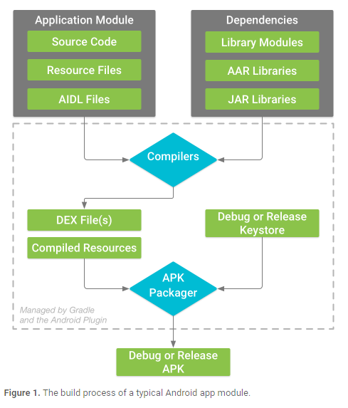

###  AndroidManifest.xml

* 描述了app的基本特性，定义每个组件

### build.gradle

* project有一个，每一个module有一个。用这个文件配置gradle tools如何build app。
     
* [Configure Your Build](https://developer.android.com/studio/build/index.html)
     
     Android build system 编译app资源和资源代码，并且*打包成可以测试，部署，签名和发布的apks*。Android studio使用gradle，一种先进的build 工具包，可以自动化的管理build进程，并且允许用户灵活的自定义。
     gradle与Android studio是相互独立的。用command lines和用gradle的效果是一样的。
     优点：
     Android构建系统的灵活性允许您在不修改应用程序的核心源文件的情况下执行定制的构建配置。

#### how the Android build system works
build process包含了很多工具和进程用来将project转化成apk。the build process非常flxible，所以理解整个过程发生了什么很重要。

build process 分为这几步：
1. 编译器将源代码(Source Code)转换为DEX files，包括运行在安卓机上的字节码，其他的转换成编译资源。
2. APK Packager结合DEX文件和compile 资源变成一个单一的APK，在app能够被安装和部署到android device之前，apk必须签名。
3. The APK Packager用debug或者release keystore给apk签名。：
         * 如果正在构建debug version，那么这个app只是用来测试和分析，会用debug keystore给app签名。Android studio自动用debug keystore配置新的工程。
         * 如果正在构建一个想要release externally（在外部或者市场发布）的release version的app，会用release keystore为app签名,如何创建一个release keystore，请阅读[在Android studio签名app](https://developer.android.com/studio/publish/app-signing.html#studio)
4. 在生成最后的APK之前， the packager用[zipalign工具](https://developer.android.com/studio/command-line/zipalign.html)优化app让app运行在安卓机上占更少的内存。
      
#### Custom Build Configurations(自定义构建配置)

      gradle帮助配置build的下面几个部分：
      *Build Types*
      *Product Flavors*
      *Build Variants*
      *Manifest Entries*
      *Dependencies*
      *Signing*
      *ProGuard*
      *Multiple APK Support*

#### Build Configuration Files（settings.gradle file）


      the default project structure for an android app module.
  settings.gradle 工程根目录root project directory ，tell gradle which modules it should include when building your app。
  `include':app'`
  multi-module projects 需要 specify each module that should go into the final build。

####the top-level build file（build.gradle  file）
root project directory .定义在工程中适用于所有模块的的构建配置。
by defaul，用*buildscript*模块去定义工程中对所有模块都是公共部分的gradle repositories 和 dependencies。
sample：
```
  /**
  根据名字来，这里是build app所用的~~~
  这个地方用来配置gradle的repository和dependencies，不应该包含模块的~~~；
  比如这里可以包含Android gradle的插件，因为这个插件提供了额外的gradle命令需要用来build app modules。
 * The buildscript block is where you configure the repositories and
 * dependencies for Gradle itself—meaning, you should not include dependencies
 * for your modules here. For example, this block includes the Android plugin for
 * Gradle as a dependency because it provides the additional instructions Gradle
 * needs to build Android app modules.
 */

buildscript {

    /**
     * The repositories block configures the repositories Gradle uses to
     * search or download the dependencies. Gradle pre-configures support for remote
     * repositories such as JCenter, Maven Central, and Ivy. You can also use local
     * repositories or define your own remote repositories. The code below defines
     * JCenter as the repository Gradle should use to look for its dependencies.
     *
     * New projects created using Android Studio 3.0 and higher also include
     * Google's Maven repository.
     */

    repositories {
        google()
        jcenter()
    }

    /**
     * The dependencies block configures the dependencies Gradle needs to use
     * to build your project. The following line adds Android plugin for Gradle
     * version 3.0.1 as a classpath dependency.
     */

    dependencies {
        classpath 'com.android.tools.build:gradle:3.0.1'
    }
}

/**
这里是提供为所有的module用的~~~
module-specific的~~~应该在每一个module层面的build.gradle配置
 * The allprojects block is where you configure the repositories and
 * dependencies used by all modules in your project, such as third-party plugins
 * or libraries. However, you should configure module-specific dependencies in
 * each module-level build.gradle file. For new projects, Android Studio
 * includes JCenter and Google's Maven repository by default, but it does not
 * configure any dependencies (unless you select a template that requires some).
 */

allprojects {
   repositories {
       google()
       jcenter()
   }
}
```
####Configure project-wide properties
Android工程有很多模块，定义project等级的公共的属性很有用，可以增加extra properties到这个ext block 在top-level build.gradle 文件。

