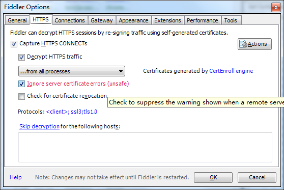
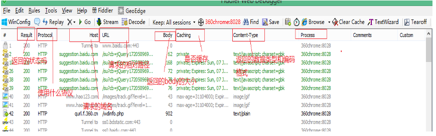
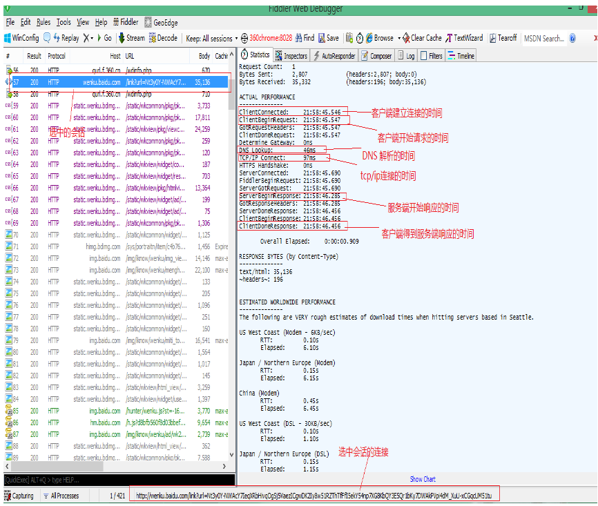
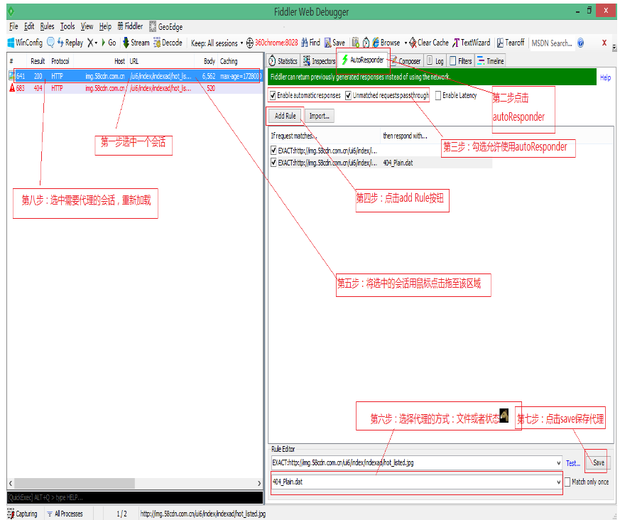

快捷键 
ctrl+X  清屏

[fiddler原理](http://blog.csdn.net/chaoyu168/article/details/51065644)
Fiddler 是以代理web服务器的形式工作的，它使用代理地址:127.0.0.1，端口:8888。当Fiddler退出的时候它会自动注销，这样就不会影响别的程序。不过如果Fiddler非正常退出，这时候因为Fiddler没有自动注销，会造成网页无法访问。解决的办法是重新启动下Fiddler。

[用fiddler对android应用进行抓包]
所以可以用手机设置proxy的方式用fiddler抓包
fiddler设置可以监听https：
tools-->fiddler options --> https --> 勾选Decrypt HTTPS trafic --> 勾选Ignore server certificate errors
如图所示：
fiddler设置可以远程连接：
tools-->fiddler options--> https （设置是否可以截获https） 

然后手机联网设置代理：（连接安装了fiddler的电脑）
服务器选择安装了fiddler的电脑ip地址（cmd-->ipconfig 获取IP地址） 端口号在fiddler options里面的connection里面有端口号设置（fiddler是8888端口号）
设置完毕之后 在浏览器中输入：" http://127.0.0.1:8888 "
####注意：
1. 电脑本来连接了代理（配置代理服务器）用来翻墙，然后fiddler使用期间会自动管理这个代理，可以看到代理服务器里面写的http：127.0.0.1（本机） 端口号：8888，应该是电脑先连接fiddler这个代理，然后连接之前翻墙的代理；关闭fiddler之后代理恢复。

2. *如果手机和电脑不在一个域，ip地址，大家都懂的~那么手机肯定连不上电脑的fiddler，因为根本ip地址根本不在同一个域，找不到啊*

3. 如果只需要监控一个软件，可结合系统流量监控，关闭其他应用网络访问的权限。

4. 关闭电脑的防火墙

5. 如果需要抓取手机app的数据包，需要手机和电脑在都连接同一个无线网络

6. 抓完包以后将fiddler关闭(提高访问网络的速度)同时将手机上的代理关闭 (如果不关闭代理，当fiddler关闭，或者是两者连接的不是同一无线网络，手机会不能正常的访问网络)

####会话面板说明

####某会话的简单分析

####MOCK数据：替换服务器端返回的数据

利用”autoresponser”可以替换服务器端返回的文件，当调试的时候需要替换服务器端返回的数据的时候，比如一个已经上线的项目，不可能真正的替换器某一个文件，我们可以这样来操作。开发的时候，需要一些数据，但是不能一直等着