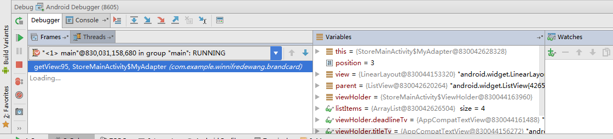

run  -- > attach debugger to android device 
[原文传送门](http://blog.csdn.net/yaoobs/article/details/51296198)

F8 step over(单步调试)进入下一步
F7 step into(进入该方法之中)
shift+F8  step over（从该方法出来）
run to cursor（Alt+F9） 可以在断点中跳转
