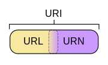

URI = Universal Resource Identifier 统一资源标志符
URL = Universal Resource Locator 统一资源定位符
URN = Universal Resource Name 统一资源名称

三者的关系：

>URI可被视为定位符（URL），名称（URN）或两者兼备。统一资源名（URN）如同一个人的名称，而统一资源定位符（URL）代表一个人的住址。换言之，URN定义某事物的身份，而URL提供查找该事物的方法。URL是一种URI，它标识一个互联网资源，并指定对其进行操作或获取该资源的方法。可能通过对主要访问手段的描述，也可能通过网络“位置”进行标识。例如，http://www.wikipedia.org/这个URL，标识一个特定资源（首页）并表示该资源的某种形式（例如以编码字符表示的，首页的HTML代码）是可以通过HTTP协议从http://www.wikipedia.org这个网络主机获得的。URN是基于某命名空间通过名称指定资源的URI。人们可以通过URN来指出某个资源，而无需指出其位置和获得方式。资源无需是基于互联网的。例如，URN urn:isbn:0-395-36341-1 指定标识系统（即国际标准书号ISBN）和某资源在该系统中的唯一表示的URI。它可以允许人们在不指出其位置和获得方式的情况下谈论这本书。

也就是说，URI分为三种，URL or URN or （URL and URI）URL代表资源的路径地址，而URI代表资源的名称。通过URL找到资源是对网络位置进行标识，如：

* http://example.org/absolute/URI/with/absolute/path/to/resource.txt
* ftp://example.org/resource.txt
通过URI找到资源是通过对名称进行标识，这个名称在某命名空间中，并不代表网络地址，如：
* urn:issn:1535-3613

