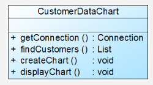
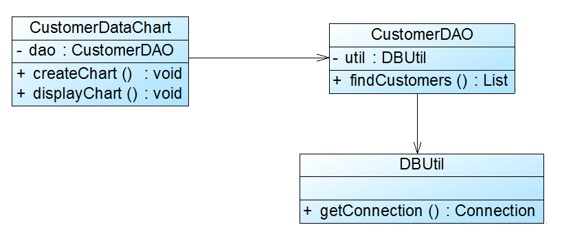

*单一职责原则(Single Responsibility Principle, SRP)*：一个类只负责一个功能领域中的相应职责，或者可以定义为：就一个类而言，应该只有一个引起它变化的原因。
*它是最简单但又最难运用的原则*

CustomerDataChart类中的方法说明如下：getConnection()方法用于连接数据库，findCustomers()用于查询所有的客户信息，createChart()用于创建图表，displayChart()用于显示图表。

CustomerDataChart类承担了太多的职责，既包含与数据库相关的方法，又包含与图表生成和显示相关的方法。如果在其他类中也需要连接数据库或者使用findCustomers()方法查询客户信息，则难以实现代码的重用。无论是修改数据库连接方式还是修改图表显示方式都需要修改该类，它不止一个引起它变化的原因，违背了单一职责原则。因此需要对该类进行拆分，使其满足单一职责原则，类CustomerDataChart可拆分为如下三个类：

      (1) DBUtil：负责连接数据库，包含数据库连接方法getConnection()；

      (2) CustomerDAO：负责操作数据库中的Customer表，包含对Customer表的增删改查等方法，如findCustomers()；

      (3) CustomerDataChart：负责图表的生成和显示，包含方法createChart()和displayChart()。

*开闭原则(Open-Closed Principle, OCP)*：一个软件实体应当对扩展开放，对修改关闭。即软件实体应尽量在不修改原有代码的情况下进行扩展。
*最重要的面向对象设计原则*
抽象化是开闭原则的关键
