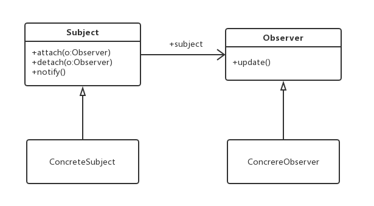

http://blog.csdn.net/itachi85/article/details/50773358
#####观察者模式介绍
观察者模式面向的需求是：A对象（观察者）对B对象（被观察者）的某种变化高度敏感，需要在B变化的一瞬间做出反应。举个例子，新闻里喜闻乐见的警察抓小偷，警察需要在小偷伸手作案的时候实施抓捕。在这个例子里，警察是观察者、小偷是被观察者，警察需要时刻盯着小偷的一举一动，才能保证不会错过任何瞬间。程序里的观察者和这种真正的【观察】略有不同，观察者不需要时刻盯着被观察者（例如A不需要每隔1ms就检查一次B的状态），二是采用注册(Register)或者成为订阅(Subscribe)的方式告诉被观察者：我需要你的某某状态，你要在它变化时通知我。采取这样被动的观察方式，既省去了反复检索状态的资源消耗，也能够得到最高的反馈速度。
**定义**
观察者模式（又被称为发布-订阅（Publish/Subscribe）模式，属于行为型模式的一种，它定义了一种一对多的依赖关系，让多个观察者对象同时监听某一个主题对象。这个主题对象在状态变化时，会通知所有的观察者对象，使他们能够自动更新自己。
####观察者模式结构图
在观察者模式中有如下角色：

* Subject：抽象主题（抽象被观察者），抽象主题角色把所有观察者对象保存在一个集合里，每个主题都可以有任意数量的观察者，抽象主题提供一个接口，可以增加和删除观察者对象。
* ConcreteSubject：具体主题（具体被观察者），该角色将有关状态存入具体观察者对象，在具体主题的内部状态发生改变时，给所有注册过的观察者发送通知。
* Observer：抽象观察者，是观察者者的抽象类，它定义了一个更新接口，使得在得到主题更改通知时更新自己。
* ConcrereObserver：具体观察者，实现抽象观察者定义的更新接口，以便在得到主题更改通知时更新自身的状态。