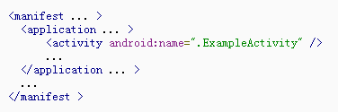
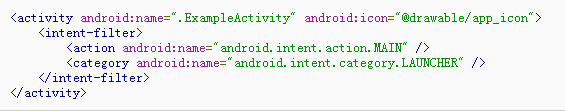
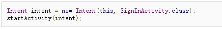
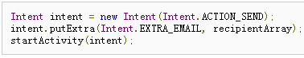
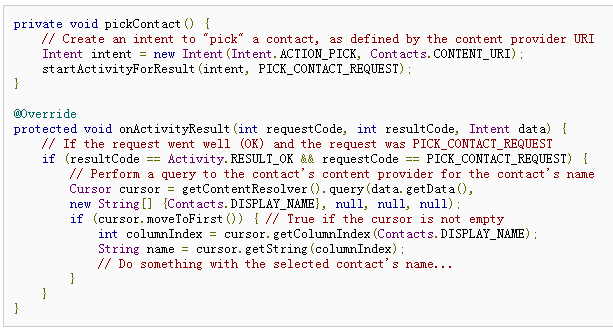
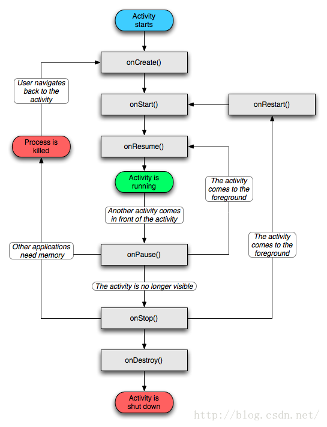

这一篇的链接：https://www.cnblogs.com/tekkaman/archive/2011/06/07/2074211.html
基本用法（简单易懂的代码）https://www.cnblogs.com/alexkn/p/5448872.html （http://www.cnblogs.com/alexkn/tag/Android/  这个人的博客，基础知识）
简介的summary：http://blog.csdn.net/cjy0000/article/details/51046319

　　【Activity】
&emsp;&emsp;一个Activity是一个应用程序组件，提供一个屏幕，用户可以用来交互为了完成某项任务，例如拨号、拍照、发送email、看地图。每一个activity被给予一个窗口，在上面可以绘制用户接口。窗口通常充满屏幕，但也可以小于屏幕而浮于其它窗口之上。

&emsp;&emsp;一个应用程序通常由多个activities组成，他们通常是松耦合关系。通常，一个应用程序中的activity被指定为"main"activity，当第一次启动应用程序的时候呈现给用户的那个activity。每一个activity然后可以启动另一个activity为了完成不同的动作。每一次一个activity启动，前一个activity就停止了，但是系统保留activity在一个栈上（“back stack”）。当一个新activity启动，它被推送到栈顶，取得用户焦点。Back Stack符合简单“后进先出”原则，所以，当用户完成当前activity然后点击back按钮，它被弹出栈（并且被摧毁），然后之前的activity恢复。

&emsp;&emsp;当一个activity因新的activity启动而停止，它被通知这种状态转变通过activity的生命周期回调函数。有许多回调函数一个activity可能会收到，源于它自己的状态变化－无论系统创建它、停止它、恢复它、摧毁它－并且每个回调提供你完成适合这个状态的指定工作的机会。例如，当停止的时候，你的activity应该释放任何大的对象，例如网络数据库连接。当activity恢复，你可以重新获得必要的资源和恢复被中断的动作。这些状态转换都是activity的生命周期的部分。
&emsp;&emsp;ApplicationContext不能启动一个activity：因为非Activity类型的Context并没有所谓的任务栈，但启动一个activity就会进行入栈（默认情况下，所有activity所需的任务栈名字为应用的包名，另外我们也可以通过制定TaskAffinity属性来指定。这个属性主要和singleTask启动模式，或者allowTaskReparenting属性配对使用，其他情况下没有意义。另外任务栈又分为前台任务栈和后台任务栈，后台任务栈中的activity位于暂停状态，用户可以通过切换后台任务栈再次调到前台。）的操作。解决问题的方法是为待启动的activity自定FLAG_ACTIVITY_NEW_TASK标记位。这样启动就会为它创建一个新的任务栈。
设置启动模式的时候（参照补充群英传），通过代码设置的优先级高于在清单文件中的设置，当两种都设置了的时候，以代码指定为准。

【Activity优先级】
&emsp;&emsp;前台优先级最高，其次是可见但非前台，最后是不可见的后台运行activity。但系统内存不足时，就会按照优先级从低到高去杀死目标activity所在的进程。如果一个进程中没有四大组件在执行，那么这个进程很快会被系统杀死。因此，一些后台工作不适合脱离四大组件而独立运行在后台中。比较好的方法是将后台工作放在service中，从而保证进程有一定的优先级，这样就不会被轻易杀死。
 
【Creating an Activity】
&emsp;&emsp;创建一个activity，你必须创建一个Activity的子类（或者一个Activity的子类的子类）。在你的子类中，你需要实现系统回调的回调方法，当activity在它的生命周期的多种状态中转换的时候，例如当activity被创建、停止、恢复或摧毁。两个最重要的回调方法是：

<strong>onCreate()</strong>
&emsp;&emsp;你必须实现这个方法。系统调用它当创建你的activity的时候。在你的实现中，你应该初始化你的activity的基本的组件。更重要的是，这里就是你必须调用setContentView（）来定义activity用户接口而已的地方。
<strong>onPause()</strong>
&emsp;&emsp;系统调用这个方法当用户离开你的activity（虽然不总是意味着activity被摧毁）。这通常是你应该提交任何变化，那此将会超越user session而存在的（因为用户可能不再回来）。
&emsp;&emsp;有若干其它生命周期回调函数你应该使用为了提供一个流畅的用户体验，并表操作异常中断会引起你的activity被中断甚至被摧毁。

  <strong>Implementing a user interface</strong> 

&emsp;&emsp;一个activity的用户接口被一个层次化的视图提供－－继承于View类的对象。每个View控制activity窗口中的一个特定矩形区域并且能响应用户交互。例如，一个view可能是个button，初始化动作当用户触摸它的时候。

&emsp;&emsp;Android提供大量预定义的view，你可以使用来设计和组件你的布局。“Widgets”是一种给屏幕提供可视化(并且交互)元素的view，例如按钮、文件域、复选框或者仅仅是图像。“Layouts”是继承于ViewGroup的View，提供特殊的布局模型为它的子view，例如线程布局、格子布局或相关性布局。你可以子类化View和ViewGroup类（或者存在的子类）来创建自己的widget和而已并且应用它们到你的activity布局中。
&emsp;&emsp;最普通的方法是定义一个布局使用view加上XML布局文件保存在你的程序资源里。这样，你可以单独维护你的用户接口设计，而与定义activity行为的代码无关。你可以设置布局作为UI使用<strong>setContentView()</strong>，传递资源布局的资源ID。可是，你也可以创建新Views在你的activity代码，并且创建一个view层次通过插入新Views到ViewGroup，然后使用那个布局通过传递到根ViewGroup给setContentView()。

&emsp;&emsp;<strong>`setContentView(R.layout.activity_player);`意思是所在的activity采用R.layout下的activity_player进行布局。</strong>

&emsp;&emsp;解释：使用setContentView可以在Activity中动态切换显示的View,这样，不需要多个Activity就可以显示不同的界面，因此不再需要在Activity间传送数据，变量可以直接引用。但是，在android SDK给我们建的默认的Hello World程序中，调用的是setContentView(int layoutResID)方法，如果使用该方法切换view,在切换后再切换回，无法显示切换前修改后的样子，也就是说，相当于重新显示一个view,并非是把原来的view隐藏后再显示。其实setContentView是个多态方法，我们可以先用LayoutInflater把布局xml文件引入成View对象，再通过setContentView(View view)方法来切换视图。因为所有对View的修改都保存在View对象里，所以，当切换回原来的view时，就可以直接显示原来修改后的样子。

<strong>【Declaring the activity in the manifest】</strong>
&emsp;&emsp;你必须声明你的activity在manifest文件为了它可以被系统访问。要声明你的activity，打开你的manifest文件，添加一个<activity>元素作为<application>元素的子元素。例如：

<strong>【Using intent filters】</strong>

&emsp;&emsp;一个<activity>元素也能指定多种intent filters－－使用<inetent-filter>元素－－为了声明其它应用程序可以激活它。

&emsp;&emsp;当你创建一个新应用程序使用Android SDK工具，存根activity自动为你创建，包含一个intent filter，声明了activity响应"main"动作，并且应该被 放置 在"launcher"分类。Intent filter看起来像这个样子。

&emsp;&emsp;<action>元素指定这是一个"main"入口点对这个应用程序。<category>元素指定，这个activity应该被列入系统应用程序列表中（为了允许用户启动这个activity）。

&emsp;&emsp;如果你希望应用程序自包含，并且不希望别的应用程序激活它的activities，那么你不需要任何其它intent filters。只有一个activity应该有“main"动作和”launcher“分类，就像前面这个例子。你不希望被其它应用程序访问原Activities应该没有intent filters而且你能启动他们通过自己显示的intent。

&emsp;&emsp;可是，如果你希望你的activity响应影含的intents，从其它应用程序（和你自己的），那么你必须定义额外的intent filters为这个activity。每一种你希望响应的类型的intent，你必须包含<intent-filter>，包含<action>元素，可选的，一个<category>元素并且/或一个<data>元素。这些元素指定你的activity能响应的intent的类型。

   <strong> 【Starting an Activity】</strong>

&emsp;&emsp;你可以开启另一个activity通过startActivity()，传递一个Intent描述了你希望启动的Activity。Intent指定要么准备的activity你希望启动或描述你希望完成的动作（操作系统选择合适的activity为你，可能来自定不同的应用程序）。一个intent可以传输小量数据被启动的activity使用。

&emsp;&emsp;完全工作在你的应用程序之内，你将经常需要简单的启动一个未知的activity。你可以这么通过创建一个intent显示的定义你希望启动的activity，使用类名。例如，下面显示一个activity怎么启动另一个activity命名为SignInActivity：

&emsp;&emsp;可是，你的应用程序或许希望执行一些动作，例如发送一份邮件、文件消息或者状态更新，使用你的activity的数据。在这种情况下，你的应用程序或许没有它自己的activity来完成这个动作，因此你可以促使设备上其它应用程序提供的activity来完成你的动作。这才是intent真正有价值的地方－－你可以创建一个intent描述一个你希望执行的动作，然后系统启动一个合适的activity从其它应用程序。如果有多种activities可以处理这个intent，那么 用户可以选择哪一个来执行。例如，如果你希望允许用户发送邮件，你可以创建下面的Intent:

&emsp;&emsp;EXTRA_EMAIL额外的添加给intent一个字符串数组指定email地址，当一个邮件应用程序响应这个intent的时候，它读取这些字符串数组并且放置他们到相应字段。在这种情况下，email应用程序的activity启动并且当用户执行完，你的activity恢复。

<strong> 【Starting an activity for a result】</strong>

&emsp;&emsp;有时，你或许希望接收一个结果从你启动的activity。在这种情况下，开启这个activity通过startActivityForResult()(而不是startActivity())。然后从随后的activity接收结果，实现onActiviryResult()回调函数。当随后的activity完成，它返回一个结果给你的onActivityResult()函数通过一个intent。
&emsp;&emsp;例如，或许你希望用户选择他们中的一个联系人，所以你的activity可以对这个联系人做些事情。下面是你怎么建立这样一个Intent和操作结果：

&emsp;&emsp;这个例子展现了基本的逻辑你应该使用的在你的onActivityResult()函数中，为了操作一个activity的结果。第一个条件检测是否请求成功－－如果是，那么 resultCode将会是RESULT_OK－－并且是否这个请求是否是这个响应是响知道－－在这种情况下，requestCode匹配第二个参数用startActivityForResult()的参数。在那里，代码操作activity结果通过查询返回在intent中的数据（data参数）。
&emsp;&emsp;将发生的是，一个ContentResolver实现查询content provider，返回一个Cursor允许读查询的数据。

<strong> 【Shut Down an Activity】</strong>
&emsp;&emsp;你可以关闭一个activity通过调用自身的finish()方法。你也可以关闭一个独立的activity你之前启动的通过finiActivity()。
&emsp;&emsp;注意：在大多数情况下，你不应该显示结果一个activity使用这些方法。正在下文所讨论的关于activity的生命周期，Android系统管理一个activity的生命周期为你，所以你不需要结果你自己的activity。调用这些函数对用户体验有害并且只有在你决对不希望用户返回到这个activity的情况下。

##生命周期
http://blog.csdn.net/javazejian/article/details/51932554

###Activity 的形态
#####Active/Running:
Activity处于活动状态，此时Activity处于栈顶，是可见状态，可与用户进行交互。 
#####Paused：
当Activity失去焦点时，或被一个新的非全屏的Activity，或被一个透明的Activity放置在栈顶时，Activity就转化为Paused状态。但我们需要明白，此时Activity只是失去了与用户交互的能力，其所有的状态信息及其成员变量都还存在，只有在系统内存紧张的情况下，才有可能被系统回收掉。 
#####Stopped：
当一个Activity被另一个Activity完全覆盖时，被覆盖的Activity就会进入Stopped状态，此时它不再可见，但是跟Paused状态一样保持着其所有状态信息及其成员变量。
#####Killed：
当Activity被系统回收掉时，Activity就处于Killed状态。 
Activity会在以上四种形态中相互切换，至于如何切换，这因用户的操作不同而异。了解了Activity的4种形态后，我们就来聊聊Activity的生命周期。

###典型的生命周期

alertdialog不会影响生命周期

