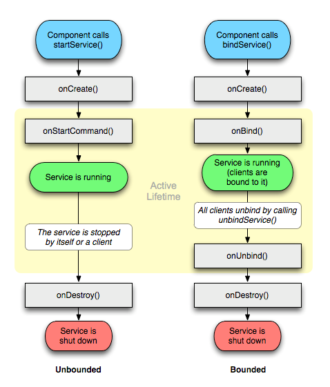

http://blog.csdn.net/guolin_blog/article/details/11952435/

&emsp;&emsp;service主要用于在后台处理一些耗时的逻辑，或者去执行某些需要长期运行的任务。必要的时候我们甚至可以在程序退出的情况下，让Service在后台继续保持运行状态。
###Service的基本用法
&emsp;&emsp;关于Service最基本的用法自然就是如何启动一个Service了，启动Service的方法和启动Activity很类似，都需要借助Intent来实现，下面我们就通过一个具体的例子来看一下。
&emsp;&emsp;新建一个Android项目，项目名交ServiceTest。

####Service的用基本法流程
1. 新建一个Android项目，项目名叫ServiceTest，选用4.0的API
2. 新建一个MyService继承自Service，重写父类的onCreate()、onStartCommand()和onDestroy()方法。（都是用的Log.d()打印了一句话而已）
3. 新建activity_main.xml作为程序的主布局文件（里面有两个按钮，一个启动service，一个停止service）
4. 新建MainActivity作为程序的主Activity，里面加入启动Service和停止Service的逻辑
  逻辑：
  在StartService按钮的点击事件里，我们构建出了一个Intent对象，并调用startService()方法来启动MyService。然后在StopSerivce按钮的点击事件里，我们同样构建出了一个Intent对象，并调用stopService()方法来停止MyService。
5. Service在AndroidManifest.xml中注册
#####** 以上所有代码：** 
**Myservice:**
```
    public class MyService extends Service {  
  
    public static final String TAG = "MyService";  
  
    @Override  
    public void onCreate() {  
        super.onCreate();  
        Log.d(TAG, "onCreate() executed");  
    }  
  
    @Override  
    public int onStartCommand(Intent intent, int flags, int startId) {  
        Log.d(TAG, "onStartCommand() executed");  
        return super.onStartCommand(intent, flags, startId);  
    }  
      
    @Override  
    public void onDestroy() {  
        super.onDestroy();  
        Log.d(TAG, "onDestroy() executed");  
    }  
  
    @Override  
    public IBinder onBind(Intent intent) {  
        return null;  
    }  
  }
```  
**activity.xml**
```
    <LinearLayout xmlns:android="http://schemas.android.com/apk/res/android" 
    android:layout_width="match_parent"
    android:layout_height="match_parent"
    android:orientation="vertical" >
  
    <Button
        android:id="@+id/start_service"
        android:layout_width="match_parent"
        android:layout_height="wrap_content"
        android:text="Start Service" />
  
    <Button
        android:id="@+id/stop_service"
        android:layout_width="match_parent"
        android:layout_height="wrap_content"
        android:text="Stop Service" />
  
    </LinearLayout>
```
**MainActivity**
```
    public class MainActivity extends Activity implements OnClickListener {
  
    private Button startService;
  
    private Button stopService;
  
    @Override
    protected void onCreate(Bundle savedInstanceState) {
        super.onCreate(savedInstanceState);
        setContentView(R.layout.activity_main);
        startService = (Button) findViewById(R.id.start_service);
        stopService = (Button) findViewById(R.id.stop_service);
        startService.setOnClickListener(this);
        stopService.setOnClickListener(this);
    }
  
    @Override
    public void onClick(View v) {
        switch (v.getId()) {
        case R.id.start_service:
            Intent startIntent = new Intent(this, MyService.class);
            startService(startIntent);
            break;
        case R.id.stop_service:
            Intent stopIntent = new Intent(this, MyService.class);
            stopService(stopIntent);
            break;
        default:
            break;
        }
    }
  
    }
```
**Manifest**
```
    <?xml version="1.0" encoding="utf-8"?>
    <manifest xmlns:android="http://schemas.android.com/apk/res/android"  
    package="com.example.servicetest"  
    android:versionCode="1"  
    android:versionName="1.0" >
  
    <uses-sdk  
        android:minSdkVersion="14"  
        android:targetSdkVersion="17" />
  
    <application  
        android:allowBackup="true"  
        android:icon="@drawable/ic_launcher"  
        android:label="@string/app_name"  
        android:theme="@style/AppTheme" >
          
    ……
  
        <service android:name="com.example.servicetest.MyService" >
        </service>
    </application>
  
    </manifest>
```
###Service生命周期
http://blog.csdn.net/todo_/article/details/51097453

###Service和Activity通信
就是生命周期图中的第二个，有onBind()的情况。