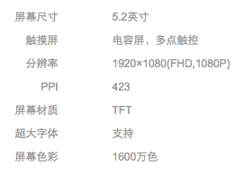
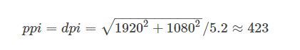

[原文传送门](http://blog.csdn.net/litengit/article/details/52005555)
[大神赵凯强，点击看详解](http://blog.csdn.net/zhaokaiqiang1992/article/details/45419023)

####概念
**分辨率 :**是指在屏幕上横纵向上的像素点数。像素的单位是px,比如上面的 1920x1080，指的就是纵向像素x横向像素。
**屏幕尺寸 :**指的就是屏幕对角线的长度。类似于我们说的电脑屏幕的尺寸。当然这里说的是英寸；1英寸＝2.54厘米。像我们平时说的5.2寸，5.5寸的手机，就是指的屏幕的英寸长度。
**像素密度 :**指的是屏幕的像素密度，即我们的屏幕上每英寸的像素点数。用英文就是“dot per inch”, 我们平时使用的是它们的缩写“dpi”。根据其定义我们就可以知道，像素密度跟屏幕的大小和屏幕的分辨率都有关系。跟”dpi”相近的还有一个“PPI”，”PPI”为 “pixel per inch”的缩写，意为每英寸的像素点数，跟上面的dpi 的意思很相近，其实还有些区别的，区别在于“dot”和“pixel”之间,当然在这里我们可以理解为一个意思，如果要细究它们的区别的请参看 [PPI和DPI 的区别](https://99designs.com/blog/tips/ppi-vs-dpi-whats-the-difference/) 。我们可以根据其手机的尺寸和分辨率算出它们的像素密度，比如华为荣耀7，下图是我在京东上截的它给出的参数图：

屏幕尺寸5.2寸，分辨率1920*1080

**公式** ppi=dpi=对角线的分辨率/屏幕对角线长度（屏幕尺寸）
**dip/dp:**dip跟dp 其实是一个意思，都是 Density Independent Pixels 的缩写，即密度独立于像素，也就是说密度跟像素无关。根据上面我们提到过dpi,如果一英寸里含有160像素，这个屏幕的像素密度就是 160dpi。在 Android 就是以160dpi为基准， 在160dpi的手机上1dp = 1px ,如果是320dpi的手机上 1dp = 2px。以此类推。如果我们在 160dpi 的手机上划一条 160px的横线显示起来会跟屏幕的宽一样，如果我们在在320dpi的手机上划一条160px 的线，则会显示为屏幕宽的一半。当我们使用dp作为单位时，效果就不一样了，如果我们画一条160dp 的横线，这两种手机的显示都是为屏幕的一半。

| 名称 | 像素密度范围 |
|：----|：-----|
| mdpi     | 120dpi-160dpi |
| hdpi     |160dpi-240dpi |
| xhdpi    |240dpi-320dpi |
| xxhdpi   |320dpi-480dpi |
| xxxhdpi  |480dpi-640dpi |

可以看出它们的比例由上往下是：2:3:4:6:8