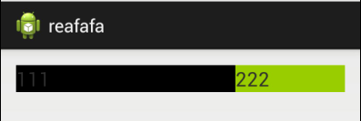
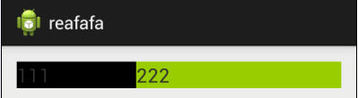

[原文传送门](http://blog.csdn.net/yanzi1225627/article/details/24667299)
**首先声明只有在Linearlayout中，该属性才有效。**
之所以android:layout_weight会引起争议，是因为在设置该属性的同时，设置android:layout_width为wrap_content和match_parent会造成两种截然相反的效果。
**代码一：match_parent**
```
    <LinearLayout  
       android:layout_width="match_parent"  
       android:layout_height="wrap_content"  
       android:orientation="horizontal" >  
  
       <TextView  
           android:layout_width="match_parent"  
           android:layout_height="wrap_content"  
           android:layout_weight="1"  
           android:background="@android:color/black"  
           android:text="111"  
           android:textSize="20sp" />  
  
       <TextView  
           android:layout_width="match_parent"  
           android:layout_height="wrap_content"  
           android:layout_weight="2"  
           android:background="@android:color/holo_green_light"  
           android:text="222"  
           android:textSize="20sp" />
    </LinearLayout>    
```
**效果：**

**代码二：match_parent**
```
    <LinearLayout  
    android:layout_width="match_parent"  
    android:layout_height="wrap_content"  
    android:orientation="horizontal" >  
  
    <TextView  
        android:layout_width="wrap_content"  
        android:layout_height="wrap_content"  
        android:layout_weight="1"  
        android:background="@android:color/black"  
        android:text="111"  
        android:textSize="20sp" />  
  
    <TextView  
        android:layout_width="wrap_content"  
        android:layout_height="wrap_content"  
        android:layout_weight="2"  
        android:background="@android:color/holo_green_light"  
        android:text="222"  
        android:textSize="20sp" />  
    </LinearLayout>  
```
**效果**


#### <font color="#f55f5c">原因</font>
**android:layout_weight的真实含义是:一旦View设置了该属性(假设有效的情况下)，那么该 View的宽度等于原有宽度(android:layout_width)加上剩余空间的占比！**

**控件宽度 = 控件的原有宽度 +（（LinearLayout宽度 - 所有子控件宽度总和）*控件的weight的占比)**

设屏幕宽度为L，在两个view的宽度都为match_parent的情况下，原有宽度为L，两个的View的宽度都为L，那么剩余宽度为L-（L+L） = -L, 左边的View占比三分之一，所以总宽度是L+(-L)*1/3 = (2/3)L.事实上默认的View的weight这个值为0，一旦设置了这个值，那么所在view在绘制的时候执行onMeasure两次的原因就在这。
Google官方推荐，当使用weight属性时，将width设为0dip即可，效果跟设成wrap_content是一样的。这样weight就可以理解为占比了！